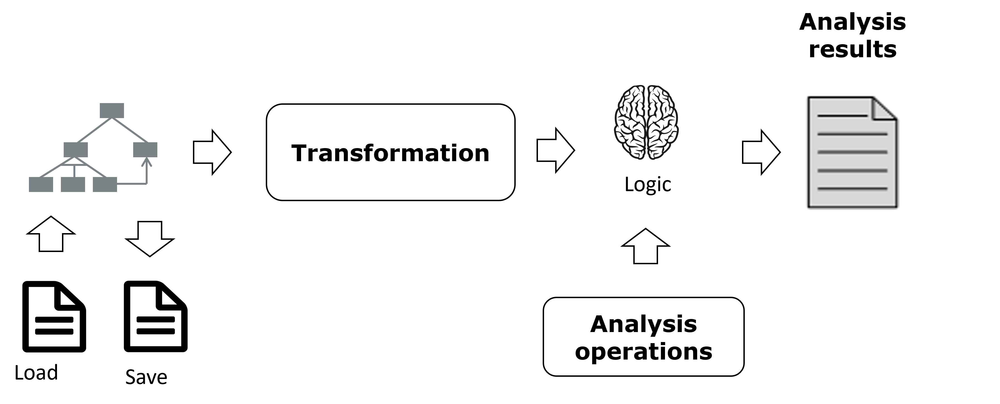
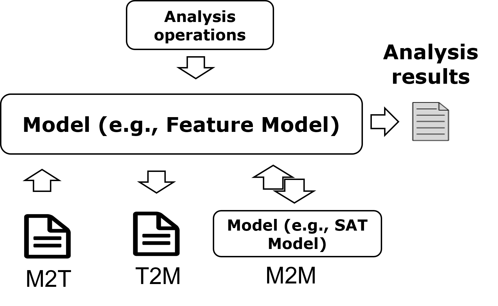

# Flamapy as framework
{: .no_toc }

## Table of contents
{: .no_toc .text-delta }

1. TOC
{:toc}

## Some history
The AAFM was developed using the process shown in Figure 1.
This process started by translating the information in the feature
model to a logic paradigm (usually SAT) and then performing a
set of operations over that logic paradigm that retrieves useful
information for the software engineer. In the past, some of the  authors 
also developed the fama tool suite, which faced several evolution problems, being some of them related to its monolitic architecture. 

When faced with the challenge of building a new tool, we were
inspired by the MDE community. For each variability model over
which we can reason, we will implement a set of metaclasses representing that variability, operations over that set of meta-classes, and transformations of three types. First, text-to-model
(T2M); to read the serializations of the models to memory. Second,
model-to-text (M2T) to serialize the models into different formats
and different model-to-model (M2M) transformations to translate
the models between them and extract the metrics in the most appropriate logic paradigm. Figure 2 shows the basic concepts of this
process.

A common scenario for AAFM is that we start by executing a
T2M transformation to read a UVL file. We can then perform basic
operations, such as counting the number of feature leaves within
the model. Then, we might translate this into a SAT metamodel to
perform a more complex analysis. However, we will also be able to
serialize that SAT metamodel in a CNF format.

## Flamapy framework architecture

The  framework employs an architecture inspired by Model-Driven Development (MDD) principles, designed to facilitate the automated analysis of feature models. The architecture is modular and highly extensible, making it easy to integrate new functionalities and analysis methods.

### Core Components

#### Metamodels:
   - **Definition**: Metamodels represent the abstract syntax of different variability models, defining their structure and constraints.
   - **Implementation**: Each metamodel is encapsulated in a plugin, which includes the necessary classes and operations for analysis.

#### Plugins:
   - **Function**: Plugins are fundamental components of the framework, encapsulating metamodels, operations, and transformations. They can be easily added or modified to extend the framework's capabilities.
   - **Modules**:
     - **Metamodel Classes**: Contain the core definitions for the model elements.
     - **Operations**: Implement specific analysis functions using the metamodel elements.
     - **Transformations**: Handle conversions between different model representations.

#### Transformations:
   - **Text-to-Model (T2M)**: Reads and parses textual representations of models into in-memory objects.
   - **Model-to-Text (M2T)**: Serializes in-memory models back into text formats.
   - **Model-to-Model (M2M)**: Transforms models from one metamodel to another, enabling different types of analysis.

## Subsections
{: .fs-6 .fw-300 }